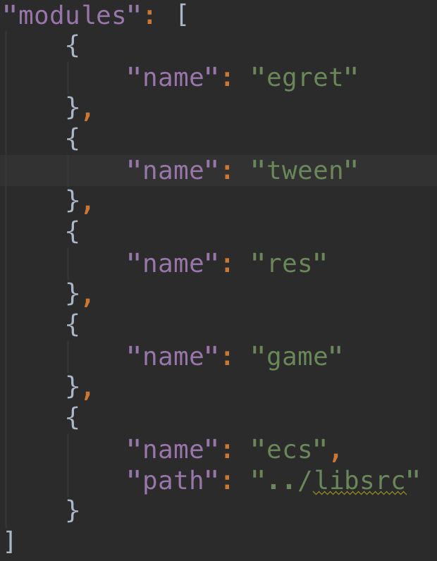
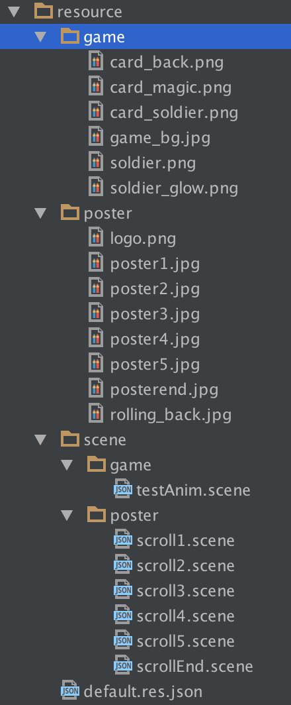
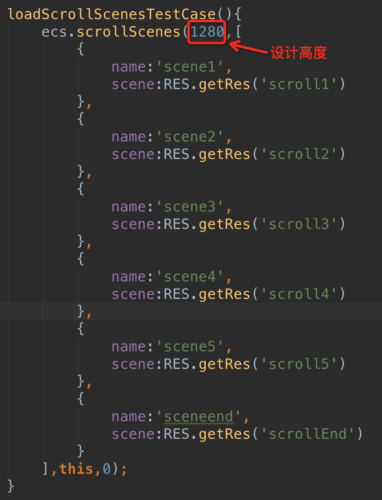
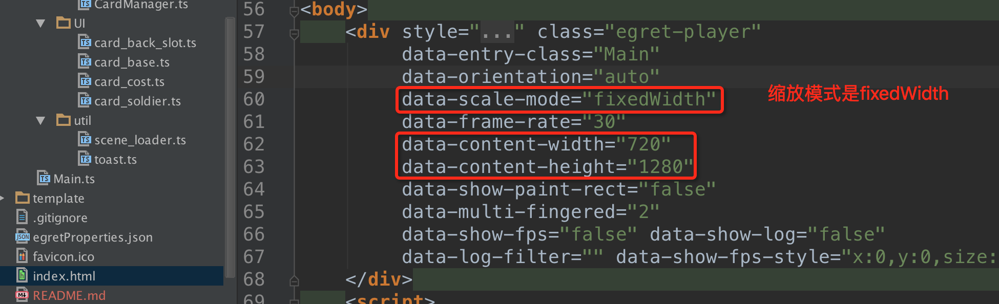
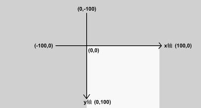
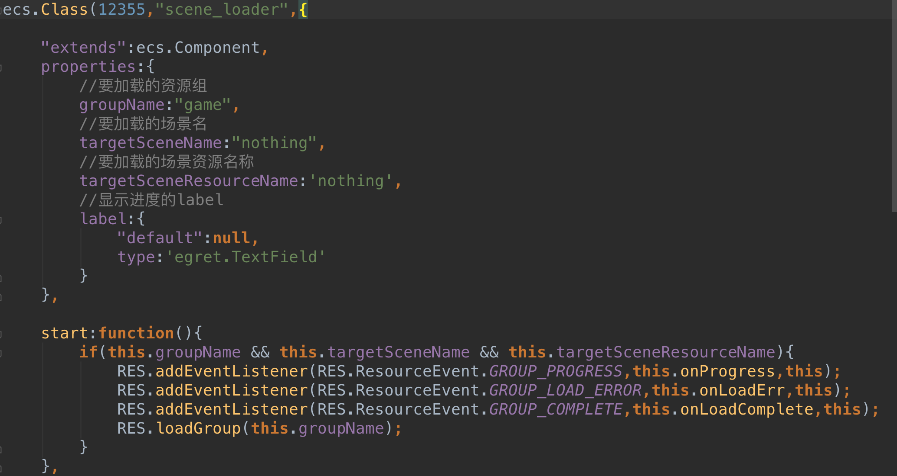

Egret ECS Support Library
==================
#1.概述
EgretECS支持库是一套建立在Egret引擎之上的横跨游戏与应用的开发流框架,通过场景文件(.scene)组织静态资源构成运行时画面元素,通过编写组件脚本(.ts)扩展运行期间的行为。
#2.快速上手
##1.工程引用
首先为你的工程引入官方的ECS的第三方支持库（引用方法详见官网教程），并请确保引入了egret,tween,res,game基本库,如图:

然后在命令行下执行 

```
egret build -e
```

##2.资源文件配置
将已经编辑好的``.scene``文件拷贝到资源目录中(编辑规则见下文)，和其他资源一样配置到统一的资源配置文件中，为了方便在一个场景中动态加载其他场景，我们把海报展示和游戏分成两个组，如图是demo资源结构


##3.egret代码
在egret中需要填写的代码并不多,ecs目前支持三种API方式载入场景:

	1.ecs.parse  载入单场景
	2.ecs.scrollScenes  一次载入多个场景，并以竖屏滚动的方式载入其他场景
	3.ecs.switchScene 从一个已存在的场景切换到另一个场景或一个新的场景

其中为了适配不同的视口大小，第二种载入方式需要输入屏幕设计高度，其他的通用参数为场景名称(用于场景切换)，要添加的容器(一般为this)，以及起始页面序号。
如图：



	注意1:在html文件中需要指定设计宽高并设置缩放模式，由于存在多页场景适配问题需要设置成固定宽度模式(fixedWidth)

	注意2:即将载入的场景文件(.scene)必须和其他该场景内使用的资源(图片等)一起在执行载入代码前载入完毕，场景生命周期内将使用同步函数配置需要用到的资源。
#3 场景文件编辑规则
场景文件的编辑需要可视化编辑器提供支持，目前插件工具已在开发之中，以下是场景编辑规则，高级开发者可以实验性地手动编辑参数调整效果。
##1.创建场景
创建一个新场景的文件结构如下:

```
[{
  "type": "ecs.Node",
  "name": "NewlyBuiltNode",
  "id": 1,
  "parent": null,
  "properties": {
    "x": 360,
    "y": 640,
    "rotation": 0,
    "scaleX": 1,
    "scaleY": 1,
    "anchorX": 0.5,
    "anchorY": 0.5,
    "width": 720,
    "height": 1280,
    "alpha": 1,
    "color": "#ffffff"
  },
  "children":[],
  "components":[]
}]
```
默认创建的场景是一个置顶节点(Node)，实体组件系统只涉及两种基本的类型即``实体``和``组件``，他们对应的类型为``Node``和``Component``。

	注意1:id值是由编辑器自动生成的不重复编号，可以手动赋予任何不重复的值
	注意2:场景文件最外层数据结构为数组
	
由于egret引擎采用了绝对锚点，创建场景必须设置场景宽高，编辑器会自动设置我们在index.html中设置的宽高值，在这里我们就手动设置设计时的宽度为720高度为1280。
egret默认坐标（0，0）点为画布左上角，scale和ancher也采用同一坐标设置。
如图


	注意:egret只支持绝对锚点，但是这里的锚点(anchorX和anchorY)已转换成相对锚点，可以放心使用(0.5,0.5)中心点设置，但场景顶级可视化元素初始坐标(0，0)依然会被添加到父级的左上角，所以这里需要手动设置绝对位移为宽高的半值使其被放置到屏幕中心。
##2.添加子节点
子节点被添加到父节点时需要将其json结构型拷贝入父亲的children数组属性内，并将parent的id值设置为父节点的id值

	注意：创建节点和组件都需要我们代替编辑器手动设置一个唯一的int类型的id值，并将其作为引用值填入其他引用到该结构的地方。
##3.为节点添加组件
目前ecs库支持的组件如下：

###1.Sprite 精灵组件
json结构型如下：
```
{
  "type":"egret.Bitmap",
  "name":"Sprite",
  "id":-1,
  "node":-1,
  "properties":{
    "texture":""
  }
}
```
node为所添加上的节点的id值
properties是组件对外提供的参数化配置属性集，其中Script组件可以自由设置该集合，其他组件只能对支持的属性进行参数化配置。
该值是一个序列化值，将会在所有节点和组件装配完毕后进行赋值。
Sprite当前只有一个可配置参数texture，表示使用的纹理，直接添加res需要使用到的key名即可。

	注意1.组件可能会使用所在节点的基本属性x,y,rotation,scaleX,scaleY,anchorX,anchorY,width,height,alpha,color,也可能不使用,部分属性做了属性绑定。
	
###2.Label 文本组件
json结构型如下：

```
{
  "type":"egret.TextField",
  "name":"Label",
  "id":-1,
  "node":-1,
  "properties":{
    "stroke":1,
    "strokeColor_des":"0x111111",
    "strokeColor":1118481,
    "enableWrapText":true,
    "textAlign":"CENTER",
    "text":"Egret ECS",
    "size":16
  }
}
```
	* stroke 为文字描边宽度 整数类型
	* strokeColor 为文字描边颜色 整数类型
	* enableWrapText为 设置文字是否被外层容器包裹 否的话长文字会被截断
	* textAlign 为文字相对于父级容器的贴齐方式 可选值
				  "LEFT_TOP"
				  "RIGHT_BOTTOM"
            "RIGHT_TOP"
            "LEFT_BOTTOM"
            "CENTER"
            "TOP"
            "LEFT"
            "BOTTOM"
            "RIGHT"
	* text 为文字内容
	* size 为文字大小
	
###3.Animation 动画组件
目前Animation组件使用tween缓动库实现属性动画,
未来会加入game库关键帧动画的支持。

```
{
  "type": "egret.Tween",
  "name": "Animation",
  "id": -1,
  "node": -1,
  "properties": {
    "defaultClip": "",
    "clips": []
  }
}
```
	* defaultClip 设置默认播放的剪辑 string类型
	* clips 影片剪辑数组 数组类型
	
以下是一个影片剪辑的结构型		

```
{
                  "name": "draw_a_card",
                  "keyframes": [
                    {
                      "x": 538,
                      "y": -112,
                      "rotation": -51,
                      "scaleX": 1,
                      "scaleY": 1,
                      "alpha": 1
                    },
                    {
                      "x": -15,
                      "y": -137,
                      "rotation": -2,
                      "scaleX": 4,
                      "scaleY": 4
                    },
                    {
                      "x": 11,
                      "y": -135,
                      "rotation": 4,
                      "scaleX": 4,
                      "scaleY": 4
                    }
                  ],
                  "durations":[500,700]
                }
```
	* name 影片剪辑的名称 用于播放特定的影片
	* keyframes 关键帧 properties基本属性集
	* durations 帧间时长 ms为单位的数组 可以更好地控制播放(例如倒放)
	
	注意:动画组件有专门的API
	component.play(clipName);正向播放一个剪辑
	component.playReverse(clipName);逆向播放一个剪辑
	component.onPlayEnd(clipName,keyframe);一个剪辑到精确到帧的播放终止事件回调
	其他API正在完善中。
###4.Script 脚本组件
组件化的开发方式不同于传统编写API的方式，脚本组件是执行用户代码的容器，所有的代码在组件的生命周期回调函数中被调用，除了name对应脚本名之外，对外声明的properties为在在脚本中声明的properties的编辑时序列化(所有的对象引用用其id表示)配置，具体请看第四章<脚本编写>规则。
以下是scene_loader场景加载器组件的场景内结构

```
{
        "type":"ecs.Component",
        "name":"scene_loader",
        "id":13,
        "node":1,
        "properties":{
          "groupName":"game",
          "targetSceneName":"game",
          "targetSceneResourceName":"testAnim",
          "label":1011
        }
}
```
这里的属性为在编辑器中由参数配置人员手动输入配置的(需要编辑器支持)
为了加载一个场景我们需要所需要的资源组的key名，为目标场景命名game，配置加载的场景文件key名，最后将加载情况配置到名为label的引用属性上(指向一个已经存在的Label组件)
#4.编写脚本
如图是scene_loader的一个脚本实现
为了避免与ts中的保留关键字冲突我们将部分属性设置成引号(例如'extends'和'default')


其中properties内为属性定义，目的是告诉编辑器该组件需要接受配置的参数，而并非实际获得的值，对于基本类型的直接赋值即可，对于引用类型和数组类型可以使用如下几种方式:

```
props:{
	'default':null,
	type:"Sprite"
}
```
```
props:{
	'default':null,
	type:ecs.Node
}
```
```
props:{
	'default':[],
	type:['Sprite']
}
```
```
props:{
	'default':[],
	type:[ecs.Node]
}
```
__start__ 函数是生命周期函数，是用户代码的入口。
它在场景内所有实体和组件被实例化组装后，所有组件的声明参数被正确注入之后调用。
该方法确保了对场景全局所有元素的访问能力，是该组件处于“就绪”状态的表示。

__onLoad__ 也是生命周期函数，它在当前组件实例化后即刻调用，此时不能保证所有属性已被注入，此时可能访问到的对外声明的引用值为undefined，是该组件处于"可展示"状态的表示。

onLoad主要在场景过场中调用，范例``src/scripts/anim/label_anim_sets.ts``制作了类似于ppt的过场动画效果，多场景的切换只需要各个场景处于"可展示"状态即可，快速滑动也并不能触发所有场景的start回调（后续版本会对回调时机进行优化）。

一个实际的应用是避免用户在滑动中频繁启动复杂场景（例如游戏）并导致滑动阻塞。

	注意1：场景文件中引用的脚本名称为ecs.Class()的第二个参数，并非脚本的文件名。
	注意2：ecs.Class()的第一个参数为保留值，由编辑器设置，此处可以任意编写不重复的id值。
	


